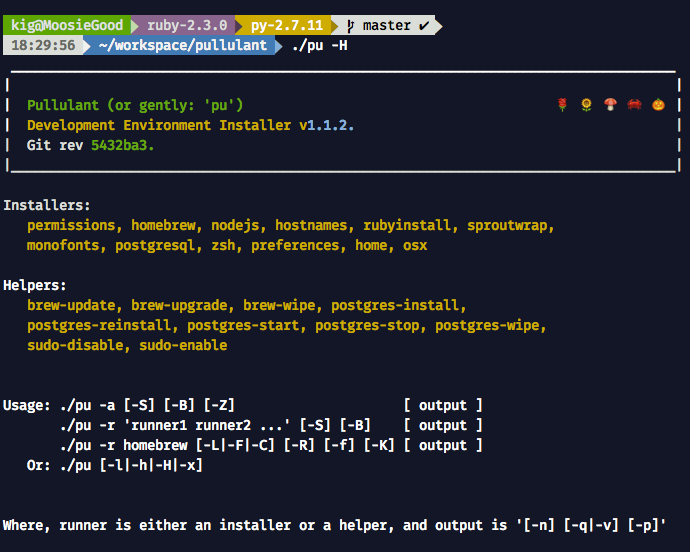

# Pullulant Development Environment on Mac OS-X

## Why?

This is a project that is the basis for setting local dev environment of several San Francisco startups and independents – it captures the setup that originated as a small wrapper around [Sprout-Wrap](https://github.com/pivotal-sprout/sprout-wrap) cookbook. But the cookbooks were too brittle seemingly, especially lately around HomeBrew, and kind of difficult to fix: for each sprout-something cookbook you must fork it first, fix the problem, then fork sprout-wrap, point to your fixed version in the Cheffile, then run it your forked version, and also maintain it until Pivotal merges your changes. Just not really that awesome of a process. 

With this installer everything is right at your fingertips: you can fix it instantly. 

The project essentially combines a bunch of steps that I do to run a fully automated (even unattended) setup of the development environment for projects involving building javascript, nodejs, ruby, python, C/C++, or even Arduino applications on on Mac OS-X. This installer condenses a ton of personal experience and taste, merges it with that of Pivotal Labs, and gives you an easy to use modular installer that can run the entire thing at once, or or one thing at a time.

It uses `brew`, and many automated tasks that are customizing your environment to look and do what real pros need for their development :) Ok, that's a joke, but seriosly, this has a lot of goodies. Try it! :)

Check out the script usage and the sexy prompt you might get after running it!



## What's that name?

"Pullulant" – it is Latin for "Sprout". [Sprout-Wrap](https://github.com/pivotal-sprout/sprout-wrap) is a large chunk of this install, so the names gives credit where credit is due.

## Pre-Install – OS-X Preparation

  1. Run `xcode-select --install` to make sure you have dev tools (although installer will still run it in the beginning)
  2. Run OS-X Updates if any, and reboot if requested.
  3. Go to _System Preferences / Sharing_, unlock the panel and set the hostname of your system, if it's currently set to a default.

### About your OS-X user

Note: shared resources used by the Homebrew, such as files under `/usr/local`,
will change ownership to the user running this installer, with full `xwr`
permissions for user and the group. This is so that the effects of any
previously run `sudo brew` nuisance are neutralized.

Typically your group will be `staff`.  Whatever group you are, that group is
applied to the folder list defined in config (`/usr/local` and `/var/chef`), with
permissions also reset to `xwr`. The idea is that this move should permit
multiple co-existing users to share `/usr/local` and `/var/chef` at the same time.  

Note that the current OS-X user must be configured as "Admin" on the Mac, and upon
entering their password after the first request for `sudo`, the user will be
modified to allow password-less `sudo` access for the duration of the script.
At the end of the script, that access is removed.

You can use the helpers to enable/disable password-less sudo in your environment,
by running `./pu -r sudo-enable` or `./pu -r sudo-disable`.

## Install

  1. If you don't already have SSH keys setup on this machine, now is the time: `ssh-keygen -t rsa -b 4096 -C "${USER}@${HOSTNAME}"; cat ~/.ssh/id_rsa.pub | pbcopy`
  2. Add the new SSH key to the Github settings page: https://github.com/settings/ssh
  3. Run the following installer:

```bash
  curl -fsSL 'http://sw.im/pu-bootstrap' | /usr/bin/env bash
```

## After a Successful Install

 * Reboot (required after the first successful install!) or you may get weird
   Security Agent errors.
 * Open System Preferences, Security & Privacy, choose Privacy tab and
   unlock the lock at the bottom. After that choose Accessibility and then check "ShiftIt" application.
 * Search in Spotlight, and start the following apps:
    * iStat Menus – click install when it comes up
    * Alfred 2

## What's Installed

### Languages

This setup is tailored for web application development, and it's default set
of packages is definitely biased towards ruby, installing both `rbenv` and `ruby-build`.  

That said, tools such as `pyenv` are also installed, which makes installing multiple
versions of `python` a breeze. Similarly, `npm` and `bower` are both installed by default.

### Developer Necessities

  * iTerm2 – mandatory replacement for Terminal :)
  * ShiftIt – use Ctrl-Option-Cmd with arrows to quickly align windows on the screen.
  * iStatMenus
  * Typical services needed for building web applications:
    * PostgreSQL 9.5
    * nginx
    * haproxy
    * Redis
    * memcached
    * ElasticSearch
    * AWS CLI
    * CMake
    * rsync

### Git

  * Git aliases
  * `hub` tool for GitHub with autocompletion on zsh
  * Git scripts for pair programming `git pair`
  * Git global defaults used by professional developers
  * GitX Application
  * Github Application

### Editors & OS-X Applications

  * RubyMine (JetBrains ruby IDE)
  * WebStorm (JetBrains JavaScript IDE)
  * CLion (JetBrains C++ IDE)
  * vim
  * Github's Atom
  * TeamViewer for remote pair programming
  * Docker toolbox + Kitematic
  * VirtualBox
  * Slack
  * GitX

### Shells

 * Bash and Bash Completion are both installed
 * Zsh and Oh-My-Zsh are installed, and zsh is made the default (unless `-Z` flag is passed)

### Programming Fonts

 * Powerline Fonts for the iTerm2 are installed, so that you get a great choice of
   coding fonts on a Mac. Powerline fonts are also required if you want to use
   'reinvent-one' zsh prompt theme.

### Google

 * Chrome
 * Drive
 * Hangouts

## Driving the Installer

You should inspect the configuration and packages defined in two files:

 * `lib/pu-config`
 * `lib/pu-packages`

Variables with names starting with `var_` can be overridden before running the
script. So can all the variables set in the `pu-packages` file, such as
which brew formulas or casks to install.

You can also copy the file `sample-config/.pullulant_packages` to your home folder,
and modify it there to suit your needs. This file is loaded before any packages
are defined, and overrides the packages the script itself defines.

```
> ./pu -x
 ___________________________________________________________________________________
|                                                                                   |
|  Pullulant (or gently: 'pu')                                                      |
|  Development Environment Installer v1.1.2.                                        |
|  Git rev e1f458d.                                                                 |
|___________________________________________________________________________________|

Installers:
  permissions, homebrew, nodejs, hostnames, rubyinstall, sproutwrap,
  monofonts, postgresql, zsh, preferences, home, osx

Helpers:
  brew-update, brew-upgrade, brew-wipe, postgres-install,
  postgres-reinstall, postgres-start, postgres-stop, postgres-wipe,
  sudo-disable, sudo-enable


Usage: ./pu -a [-S] [-B] [-Z]                     [ output ]
       ./pu -r 'runner1 runner2 ...' [-S] [-B]    [ output ]
       ./pu -r homebrew [-L|-F|-C] [-R] [-f] [-K] [ output ]
   Or: ./pu [-l|-h|-H|-x]


Where, runner is either an installer or a helper, and output is '[-n] [-q|-v] [-p]'

Global Flags:
Full run:
 -a          run [a]ll installers in their order
 -S          [S]proutwrap is disabled during the install
 -B          [B]rew-upgrade is disabled

Partial run (multiple runners can be listed in quotes or multiple -r flags):
 -r runner   run only a specified [r]unner (helper or installer)
             eg: ./pu -r 'zsh osx' -r home

Homebrew control:
             -C -F -L flags allow picking specific subset of the install.
             The flags can mix. Adding all three is the same as adding none.

 -L          Only [L]ink packages configured for brew linking
 -C          Only [C]asks are installed from a configured list
 -F          Only [F]ormulas are installed from a configured list

             These apply to all brew commands:
 -R          [R]einstall each formulae during brew install
 -K          Relin[K] all brew formulas/casks during install
 -f          [F]orce all brew commands with --force

Zsh
 -Z          Do not change the default shell to Zsh (it's still installed)

Output control:
 -p          su[p]press pretty section headers for more compact output
 -q          [q]uiet mode: stop printing commands before and after run.
 -v          [v]erbose - show each command's output, and add -v to some
 -n          dry-ru[n] print commands, but don't actually run them.

Help & Info:
 -l          [l]ist available runners  helpers and installers
 -h          this [h]elp message
 -H          this help message, and explanation of helpers and installers
 -x          same as -H but in plain ascii (also saves into doc/help)

Examples:
   ./pu -a                         # install everything
   ./pu -r reinstall-postgres      # run just reinstall-postgres
   ./pu -r brew-wipe -r homebrew   # wipe and reinstall homebrew
   ./pu -r homebrew -F -pv         # only brew formulas verbose
   ./pu -aSB                       # install everything, minus
                                   # homebrew and sprout-wrap

 Runner:
     Most common usage is with the -a  flag, that runs all installers.
     Installers are bash modules located in the ./installers folder. Each
     installer has a bash function that matches the name of the file.

     The -r flag can be supplied more than once, or once but with multiple
     arguments in quotes, eg -r 'runner1 runner2' or -r runner1
     -r runner2. Presence of this flag indicates that only specified
     runnings will run.

 Helpers
     Helpers are similar to installers, but they are not ordered, and are
     not included in the default install. They are meant to be used ad-hoc.

     You can add new installers and helpers by adding new files in the
     corresponding folders with bash functions matching the name.

     For example, to enable password-less sudo, use 'sudo-enable' helper:

     ./pu -r sudo-enable

```

## Acknowledgements

&copy; 2015-2016 Konstantin Gredeskoul, portions of the code were developed under
the generous sponsorship of [Shippo, Inc.](http://goshippo.com) and are used
with permission.

The following people assisted in building this tool:

 * Wissam Jarjoui
 * Subhi Beidas
 * Dennis Rohm
