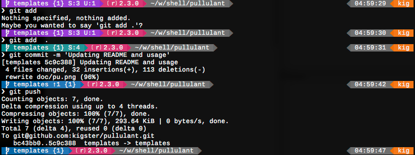

# Pullulant
## Bootstrap Your Dev Environment on Mac OS-X in Minutes

Just tell me what to run, I don't have time for this README.

```bash
curl -fsSL 'http://sw.im/pu-bootstrap' | /usr/bin/env bash
```

Alternatively, for a finer-grained control of your installation, do the following:

```bash
git clone https://github.com/kigster/pullulant
cd pullulant
./pu -FR
```

 * `-R` will run every installer (which are executable modules that typically install a particular thing), and 
 * `-F` will include every feature set (which is a collection of brew/bash-it/etc plugins or packages, grouped together by a common theme, i.e. "ruby" feature would include ruby-development related brew packages, casks, bash-it plugins, etc).

For more information, please see the full usage below.

## Pu-what?

"Pullulant" – it is Latin for "Sprout". [Sprout-Wrap](https://github.com/pivotal-sprout/sprout-wrap) was an inspiration for this install, as well as initially a large chunk of it, so the names gives credit where credit is due.  As pullulant became more mature, the role of SproutWrap in the install process shrunk significantly, and eventually it will be removed completely.

## Why Should I Use This?

This project is the basis for setting local dev environment of several San Francisco startups and independents – it captures the setup that originated as a small wrapper around [Sprout-Wrap](https://github.com/pivotal-sprout/sprout-wrap) cookbook. But the cookbooks were too small and too brittle, and kind of difficult to fix (see appendix 1). So the shell script grew.

Now Pullulant combines hundreds of small steps into modular chunks that run one after another as part of a fully automated (even unattended) setup of the development environment. This is a great setup for projects involving building javascript, nodejs, ruby, python, C/C++, or even Arduino applications on Mac OS-X. This installer condenses a ton of personal experience and taste and merges it with that of Pivotal Labs. It's design gives you an easy way to use modules that can be run all at once, or one at a time.

The installer relies on [HomeBrew](http://brew.sh/), [Sprout-Wrap](https://github.com/pivotal-sprout/sprout-wrap), and about 3K lines of bash scripting to deliver your shell goodies to the door, all while customizing your environment to look like and serve you, the oh-mightly-powerful Developer, with all of it's shine. Try it! :)

I mean – just check out the sexy BASH prompt (based on the 'Powerline Multiline' theme and "Bash-It" framework) that you will get after running it :)



## Pre-Install – OS-X Preparation

  1. Run `xcode-select --install` to make sure you have dev tools (although installer will still run it in the beginning)
  2. Run OS-X Updates if any, and reboot if requested.
  3. Go to _System Preferences / Sharing_, unlock the panel and set the hostname of your system, if it's currently set to a default.

### About your OS-X user

Note: shared resources used by the Homebrew, such as files under `/usr/local`,
will change ownership to the user running this installer, with full `xwr`
permissions for user and the group. This is so that the effects of any
previously run `sudo brew` nuisance are neutralized.

Typically your group will be `staff`.  Whatever group you are, that group is
applied to the folder list defined in config (`/usr/local` and `/var/chef`), with
permissions also reset to `xwr`. The idea is that this move should permit
multiple co-existing users to share `/usr/local` and `/var/chef` at the same time.  

Note that the current OS-X user must be configured as "Admin" on the Mac, and upon
entering their password after the first request for `sudo`, the user will be
modified to allow password-less `sudo` access for the duration of the script.
At the end of the script, that access is removed.

You can use the helpers to enable/disable password-less sudo in your environment,
by running `./pu -r sudo-enable` or `./pu -r sudo-disable`.

## Install

  1. If you don't already have SSH keys setup on this machine, now is the time: `ssh-keygen -t rsa -b 4096 -C "${USER}@${HOSTNAME}"; cat ~/.ssh/id_rsa.pub | pbcopy`
  2. Add the new SSH key to the Github settings page: https://github.com/settings/ssh
  3. Run the following installer:

```bash
  curl -fsSL 'http://sw.im/pu-bootstrap' | /usr/bin/env bash
```

## After a Successful Install

 * Reboot (required after the first successful install!) or you may get weird
   Security Agent errors.
 * Open System Preferences, Security & Privacy, choose Privacy tab and
   unlock the lock at the bottom. After that choose Accessibility and then check "ShiftIt" application.
 * Search in Spotlight, and start the following apps:
    * iStat Menus – click install when it comes up
    * Alfred 2

## Understanding the Installer

Whether or not installer fully succeeded, you will, very likely, have folder `~/workspace/pullulant` where the installer resides. If you `cd` into that folder, you can then run `pu` script with various options to install more things, to clean postgresql, etc.

In fact, `pu` comes with a whole bunch of modules that are meant to be part of the installer, but also a bunch that are meant to be used only when needed. Hence the terminology: `installer` vs `helper`.

See `pu -h` for more information, or scroll down to the section [Driving the Installer](#driving-the-installer).

## What's Installed

### Languages

This setup is tailored for web application development, and it's default set
of packages is definitely biased towards ruby, installing both `rbenv` and `ruby-build`.  

That said, tools such as `pyenv` are also installed, which makes installing multiple
versions of `python` a breeze. Similarly, `npm` and `bower` are both installed by default.

### Developer Necessities

  * iTerm2 – mandatory replacement for Terminal :)
  * ShiftIt – use Ctrl-Option-Cmd with arrows to quickly align windows on the screen.
  * iStatMenus
  * Typical services needed for building web applications:
    * PostgreSQL 9.5
    * nginx
    * haproxy
    * Redis
    * memcached
    * ElasticSearch
    * AWS CLI
    * CMake
    * rsync

### Git

  * Git aliases
  * `hub` tool for GitHub with autocompletion on zsh
  * Git scripts for pair programming `git pair`
  * Git global defaults used by professional developers
  * GitX Application
  * Github Application

### Editors & OS-X Applications

  * RubyMine (JetBrains ruby IDE)
  * WebStorm (JetBrains JavaScript IDE)
  * CLion (JetBrains C++ IDE)
  * vim
  * Github's Atom
  * TeamViewer for remote pair programming
  * Docker toolbox + Kitematic
  * VirtualBox
  * Slack
  * GitX

### Shells

 * Bash and Bash Completion are both installed
 * Zsh and Oh-My-Zsh are installed, but no changes to the default shell are made — unless `-z` flag is specified. In which case zsh is setup as a default shell.

### Programming Fonts

 * Powerline Fonts for the iTerm2 are installed, so that you get a great choice of
   coding fonts on a Mac. Powerline fonts are also required if you want to use
   'reinvent-one' zsh prompt theme.

### Google

 * Chrome
 * Drive
 * Hangouts

## Driving the Installer

```bash

 Pullulant  (or just pu)                       (Version 1.5.1) Git Rev: 12671b9 

 OS-X Installer for Web Devs, MIT License  | (c) 2015-2016 Konstantin Gredeskoul
 https://github.com/kigster/pullulant      |                       http://kig.re


Usage:
  pu  [ -R | -r 'runner runner ...' ]
      [ -F | -f 'feature feature ...'  ]
      [ -BCFHIKLNPRSTUZhilnopqtvy]
      [ -e 'expression']

Eg.
  pu -l                           # list all available runners
  pu -t                           # list all available features
  pu -RF                          # install all runners/features
  pu -r homebrew -f ruby          # install homebrew with ruby specific packages

Getting Help:                                                                   
  -h          paginated help message in full color
  -H          non-paginated help message in full color
  -x          non-paginated help message in pure ASCII
  -d          show debugging information
  -E          show usage examples

Runners:                                                                        
  Runners are modules that do certain work, i.e. install software, or remove it.
  They are located in two folders: ./helpers and ./installers and are divided
  logically into 'Helpers' and 'Installers' correspondingly. NOTE: each
  runner is a bash script with name-matching bash function inside.

  Installers  are the modules that install something new and
              are to be included in the list of a complete install. They are
              ordered. For example 'install_ruby' installs ruby and dependencies.
              To run ALL installers, use the -a flag.

  Helpers     are similar to installers, except they are not run as
              part of the full install. They must be invoked by name directly.
              Because of that, helpers tend to be more diverse in nature: some
              uninstall things, fix things, and so on.

  But collectively, helpers and installers are just 'runners' and are the 'units'
  of pullulant's magical universe...

  -R          full install: executes each runner from the './installers' dir

  -r 'runner runner ...'
              run specific installer(s) and/or helper(s) in the provided order

  -l          list available installers and helpers
    -S        [S]proutwrap is disabled during the full install
    -B        [B]rew-upgrade is disabled during the full install
    -P        No backu[P] for rsync of bash and zsh files (default is to backup)

Features:                                                                       

  Features    are a set of brew packages, bash-it plug-ins, completions
              and aliases, defined a particular theme. For example, ruby feature
              enables bash aliases and completions releated to all ruby
              development tools.  It also adds a particulat set of brew formulas
              and casks.

  -f 'feature feature ....'
              Merge packages from a provided set of features.
  -F          Merge ALL available features, currently:
              aws default docker nodejs python ruby web
  -t          List available features

Error Handing:                                                                  

              Default error handling is pessimistic: installer stops upon any
              error code returned from a single 'run' statement.
              You can control error handling at two levels:

  -i          [i]gnore errors and continue to the next 'run' statement.

  -I          Stops running the current installer that produced an error, skips
              the rest of it, and continues to the next installer. For example,
              in this mode, if one homebrew package fails to install, the rest
              of homebrew installer will be skipped, and the next installer in
              the run list will begin.

Homebrew:                                                                       

  -o          f[o]rce  applies to some installers, ie. brew (--force) and
              zsh (overwrites current shell to ZSH). Also some rsync
              installers may behave differently with -f.

              -C -F -L flags allow picking specific subset of the install.
              The flags can mix. Adding all three is the same as adding none.

  -L          Only [L]ink packages configured for brew linking
  -C          Only [C]asks are installed from a configured list
  -U          Only form[U]las are installed from a configured list

              These apply to all brew commands:
  -y          [R]einstall each formulae during brew install
  -K          Relin[K] all brew formulas/casks during install

Zsh                                                                             

  -Z          Change the default shell to ZSH and install 'oh-my-zsh'

Interaction and Output Control:                                                 

  -N          run some parts interactively, letting user confirm install
  -p          su[p]press pretty section headers for more compact output
  -q          [q]uiet mode: stop printing commands before and after run.
  -v          [v]erbose - show each command's output, and add -v to some
  -n          dry-ru[n] print commands, but don't actually run them.

Examples:                                                                       

   Run a complete installer using a union of all available features with
    default output and error handling options:

      pu -RF

   Install everything with the default (small) set of packages, but
    with an interactive check:

      pu -RN

   Install everything with specific features and plugins enabled suitable for
    ruby, python and node development, as well as install services used in web
    development such as nginx, haproxy, etc:

      pu -R -f 'ruby python nodejs web aws docker'

   Use a helper (not an installer) to wipe clean and reinstall postgresql
    from brew, create a new UTF8 database, and ensure it's running after:

      pu -r reinstall-postgres

   Wipe and reinstall homebrew, and install ruby-specific packages:

      pu -r 'brew-wipe homebrew' -f ruby

   Repair homebrew, and install additional python packages:

      pu -r 'brew-repair homebrew' -f python

   When installing brew packages, install formUlas only (-U), use --force (-o),
    and show verbose output (-v) without section headers (-p):

      pu -r homebrew -o -U -p -v

   Install everything, sprout-wrap, with all of the available features.

      pu -RFS

Debugging                                                                       

  -e expr     evaluate expression in the context of pullulant post loading.
              This can be useful if you are developing / debugging the code.

  For example, it allows you to evaluate any function that 'pu' loads into the
  bash space. Some examples  here we are evaluating library function
  pu-installers() which returns an array of all installers found in the folder.

              pu -e pu-installers

  Next, we can print every pu- related function loaded into memory:

              pu -e 'set | grep "^pu-"'

```    

You should inspect the configuration and packages defined in two files:

 * `lib/pu-config`
 * `lib/pu-packages`

Variables with names starting with `var_` can be overridden before running the
script. So can all the variables set in the `pu-packages` file, such as
which brew formulas or casks to install.

You can also copy the file `sample-config/.pullulant_packages` to your home folder,
and modify it there to suit your needs. This file is loaded before any packages
are defined, and overrides the packages the script itself defines.

## Acknowledgements

&copy; 2015-2016 Konstantin Gredeskoul, portions of the code were developed under
the generous sponsorship of [Shippo, Inc.](http://goshippo.com) and are used
with permission.

The following people assisted in building this tool:

 * Wissam Jarjoui
 * Subhi Beidas
 * Dennis Rohm

## Appendix

 1. SproutWrap is difficult to fix when it breaks. For each sprout-something cookbook you must fork it first, fix the problem, then fork sprout-wrap, point to your fixed version in the Cheffile, then run it your forked version, and also maintain it until Pivotal merges your changes. Just not really that awesome of a process.
